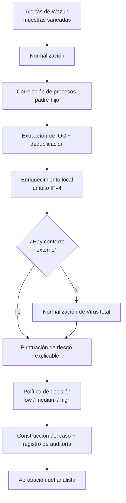

# SOC Security Automation

[](https://github.com/CarlosGutierrezR/soc-security-automation/actions/workflows/tests.yml)

[](LICENSE)

Proyecto de portfolio de Security Automation / SOAR independiente del fabricante:
un flujo en Python que convierte alertas de Wazuh en bruto en un caso SOC
explicable y auditable, manteniendo cada decisión de respuesta bajo la
aprobación del analista.

> **En 30 segundos**
> - **Problema:** los analistas repiten los mismos pasos de triaje (normalizar, correlacionar, extraer IOC, enriquecer, puntuar, redactar el caso) ante alertas recurrentes.
> - **Qué hace:** automatiza la preparación del caso, desde la ingesta de la alerta hasta el punto en que decide el analista.
> - **Base:** un laboratorio SOC propio (Wazuh + Sysmon en Windows 11) con una cadena de procesos controlada y benigna.
> - **Evidencia:** 48 pruebas automatizadas en CI, datos de ejemplo saneados y una comparación documentada de tiempos manual vs. automatizado.
> - **Seguridad:** *dry-run* por defecto, sin contención automática, sin secretos en Git.

**Contenido:** [Competencias](#competencias-demostradas) · [Flujo](#flujo) ·
[Inicio rápido](#inicio-rápido) · [Resultados](#resultados) ·
[Seguridad](#modelo-de-seguridad) · [Limitaciones](#limitaciones-actuales) ·
[English](#-english-summary)

## Competencias demostradas

| Área | Dónde mirar |
|---|---|
| Normalización de alertas SIEM (Wazuh / Sysmon) | [`normalizer.py`](src/soc_automation/normalizer.py) |
| Correlación de árbol de procesos (host + PID + GUID + ventana temporal) | [`correlation.py`](src/soc_automation/correlation.py) |
| Extracción de IOC y ajuste de falsos positivos | [`ioc_extractor.py`](src/soc_automation/ioc_extractor.py), [`test_ioc_extractor.py`](tests/test_ioc_extractor.py) |
| Enriquecimiento con threat intelligence (VirusTotal API v3, seguro por defecto) | [`virustotal_client.py`](src/soc_automation/virustotal_client.py), [`vt_normalizer.py`](src/soc_automation/vt_normalizer.py) |
| Puntuación de riesgo explicable y política de decisión | [`risk_scoring.py`](src/soc_automation/risk_scoring.py), [`decision_policy.py`](src/soc_automation/decision_policy.py) |
| Pruebas y CI (pytest, HTTP simulado, GitHub Actions) | [`tests/`](tests), [`tests.yml`](.github/workflows/tests.yml) |
| Saneamiento de datos para evidencia pública | [`docs/data-sanitization.md`](docs/data-sanitization.md) |
| Medición y comunicación honestas | [`evidence/mttr-comparison.md`](evidence/mttr-comparison.md) |

## Flujo



Caso de uso **SEC-AUTO-001**: una tarea programada benigna en el laboratorio
genera la cadena `svchost.exe -> cmd.exe`, que dispara las reglas 92052 y 92032
de Wazuh. Detalle: [`docs/SEC-AUTO-001.md`](docs/SEC-AUTO-001.md) y
[`docs/architecture.md`](docs/architecture.md) (en inglés).

## Inicio rápido

Requisitos: Python 3.13+ (la CI se ejecuta en 3.14).

```bash
git clone https://github.com/CarlosGutierrezR/soc-security-automation.git
cd soc-security-automation
python -m venv .venv
source .venv/bin/activate        # Windows: .venv\Scripts\activate
pip install -r requirements-dev.txt

python -m pytest -q              # 48 pruebas
python scripts/run_demo.py       # ejecuta el flujo sobre las alertas de ejemplo
```

La demo no hace ninguna petición de red. Para simular contexto externo de
threat intelligence:

```bash
python scripts/run_demo.py --vt-malicious 6 --vt-suspicious 1
```

## Ejemplo de salida

Salida abreviada de `python scripts/run_demo.py` (se omiten las alertas
normalizadas y el enriquecimiento):

```json
{
  "correlation": { "related": true, "type": "process_parent_child" },
  "iocs": [
    { "type": "sha256", "value": "97ac98b1a92c2860...c9ca96c7dabb" },
    { "type": "sha256", "value": "e449bce01f275cd0...e6131426e66537705e5" }
  ],
  "risk": {
    "score": 45,
    "reasons": [
      { "signal": "correlated_process_chain", "points": 20 },
      { "signal": "wazuh_level_4_6", "points": 15 },
      { "signal": "ioc_present", "points": 10 }
    ]
  },
  "decision": { "risk": "medium", "action": "analyst_review", "approval_required": true }
}
```

Cada punto de la puntuación se puede trazar hasta una señal con nombre. Con
`--vt-malicious 6 --vt-suspicious 1`, la puntuación sube a 85 y la decisión
pasa a `high` / `create_case_and_propose_containment`. La aprobación sigue
siendo obligatoria.

## Política de decisión

| Puntuación | Riesgo | Acción propuesta |
|---|---|---|
| 0-29 | low | `summary_close_candidate` |
| 30-69 | medium | `analyst_review` |
| 70-100 | high | `create_case_and_propose_containment` |

Los tres niveles fijan `approval_required: true`. No se ejecuta nada
automáticamente.

## Resultados

Medición controlada en laboratorio sobre el mismo par de alertas (3 ejecuciones
por método):

| Método | Tiempo mediano |
|---|---:|
| Revisión manual del analista | 163,4 s |
| Preparación automatizada del caso (extremo a extremo, incluido el arranque del intérprete) | 0,13 s |

**No** es una afirmación de MTTR en producción: un solo escenario, una muestra
pequeña y efecto aprendizaje en las ejecuciones manuales. Metodología y
limitaciones en [`evidence/mttr-comparison.md`](evidence/mttr-comparison.md).

## Modelo de seguridad

- El enriquecimiento externo funciona en **dry-run por defecto**. La clave de API se lee de `VT_API_KEY` (ver [`.env.example`](.env.example)) y nunca se guarda en Git.
- Sin contención ni remediación automáticas.
- Cada decisión requiere la aprobación del analista.
- La evidencia SOC en bruto está excluida de Git; las muestras y capturas públicas están saneadas.
- La CI se ejecuta con permisos de solo lectura sobre el repositorio.

## Limitaciones actuales

**No** se afirma que esté implementado:

- Validación formal del esquema de entrada.
- Consultas históricas en vivo a Wazuh o Security Onion.
- Enriquecimiento en vivo con VirusTotal de extremo a extremo dentro del flujo (el cliente existe y está probado con HTTP simulado).
- Contención o remediación automáticas.
- El extractor de dominios usa exclusiones heurísticas de nombres de fichero, no la Public Suffix List.

## Estructura del repositorio

```text
src/soc_automation/   Implementación del flujo
tests/                Pruebas automatizadas (pytest)
scripts/              Demo ejecutable
sample_data/          Muestras de entrada de Wazuh saneadas
docs/                 Caso de uso, arquitectura y notas de saneamiento (en inglés)
evidence/             Comparación de tiempos y capturas saneadas
```

## Proyectos relacionados

- [soc-detection-engineering](https://github.com/CarlosGutierrezR/soc-detection-engineering) · LAB-DET-001: ingeniería de detección sobre el mismo laboratorio (telemetría, validación de reglas, ajuste, análisis de falsos positivos).
- [soc-threat-hunting-zeek](https://github.com/CarlosGutierrezR/soc-threat-hunting-zeek) · SEC-HUNT-001: hunt de *beaconing* guiado por hipótesis sobre telemetría Zeek.

## 🌐 English summary

**SEC-AUTO-001** is a vendor-neutral Security Automation / SOAR project: a
Python workflow that turns raw Wazuh alerts into an explainable, auditable SOC
case while keeping every response decision under analyst approval.

- **Pipeline:** normalization → parent-child process correlation → IOC
  extraction → local and VirusTotal enrichment (dry-run by default) →
  explainable risk score → decision policy → case builder with audit trail.
- **Safety:** no automatic containment; `approval_required: true` at every
  risk level; API key read from `VT_API_KEY`, never committed.
- **Evidence:** 48 pytest tests in CI, sanitized Wazuh samples, and a lab
  timing comparison (163.4 s manual vs 0.13 s automated median) that is
  explicitly **not** a production MTTR claim.
- **Run it:** `pip install -r requirements-dev.txt`, `python -m pytest -q`,
  `python scripts/run_demo.py` (no network calls). Docs in `docs/` are in English.

## Autor

**Carlos Alberto Gutiérrez Rondón** · Cybersecurity & Data Engineer

[LinkedIn](https://www.linkedin.com/in/carlosgutierrez-rondon/) · [GitHub](https://github.com/CarlosGutierrezR)

## Licencia

[MIT](LICENSE)
