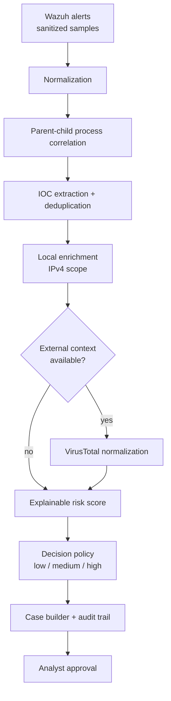

# SOC Security Automation

[](https://github.com/CarlosGutierrezR/soc-security-automation/actions/workflows/tests.yml)

[](LICENSE)

Vendor-neutral Security Automation / SOAR portfolio project: a Python workflow that turns raw Wazuh alerts into an explainable, auditable SOC case, while keeping every response decision under analyst approval.

> **In 30 seconds**
> - **Problem:** analysts repeat the same triage steps (normalize, correlate, extract IOCs, enrich, score, write the case) for recurring alerts.
> - **What it does:** automates case preparation, from alert ingestion up to the point where the analyst decides.
> - **Built on:** a home SOC lab (Wazuh + Sysmon on Windows 11) with a controlled, benign process chain.
> - **Evidence:** 48 automated tests in CI, sanitized sample data, and a documented manual-vs-automated timing comparison.
> - **Safety:** dry-run by default, no automatic containment, no secrets in Git.

## Skills demonstrated

| Area | Where to look |
|---|---|
| SIEM alert normalization (Wazuh / Sysmon) | [`normalizer.py`](src/soc_automation/normalizer.py) |
| Process-tree correlation (host + PID + GUID + time window) | [`correlation.py`](src/soc_automation/correlation.py) |
| IOC extraction and false-positive tuning | [`ioc_extractor.py`](src/soc_automation/ioc_extractor.py), [`test_ioc_extractor.py`](tests/test_ioc_extractor.py) |
| Threat-intel enrichment (VirusTotal API v3, safe by default) | [`virustotal_client.py`](src/soc_automation/virustotal_client.py), [`vt_normalizer.py`](src/soc_automation/vt_normalizer.py) |
| Explainable risk scoring and decision policy | [`risk_scoring.py`](src/soc_automation/risk_scoring.py), [`decision_policy.py`](src/soc_automation/decision_policy.py) |
| Testing and CI (pytest, mocked HTTP, GitHub Actions) | [`tests/`](tests), [`tests.yml`](.github/workflows/tests.yml) |
| Data sanitization for public evidence | [`docs/data-sanitization.md`](docs/data-sanitization.md) |
| Honest measurement and reporting | [`evidence/mttr-comparison.md`](evidence/mttr-comparison.md) |

## Workflow



Use case **SEC-AUTO-001**: a benign scheduled task in the lab produces the chain `svchost.exe -> cmd.exe`, which triggers Wazuh rules 92052 and 92032. Details: [`docs/SEC-AUTO-001.md`](docs/SEC-AUTO-001.md) and [`docs/architecture.md`](docs/architecture.md).

## Quick start

Requirements: Python 3.13+ (CI runs on 3.14).

```bash
git clone https://github.com/CarlosGutierrezR/soc-security-automation.git
cd soc-security-automation
python -m venv .venv
source .venv/bin/activate        # Windows: .venv\Scripts\activate
pip install -r requirements-dev.txt

python -m pytest -q              # 48 tests
python scripts/run_demo.py       # run the workflow on the sample alerts
```

The demo makes no network requests. To simulate external threat-intel context:

```bash
python scripts/run_demo.py --vt-malicious 6 --vt-suspicious 1
```

## Example output

Abridged output of `python scripts/run_demo.py` (normalized alerts and enrichment omitted):

```json
{
  "correlation": { "related": true, "type": "process_parent_child" },
  "iocs": [
    { "type": "sha256", "value": "97ac98b1a92c2860...c9ca96c7dabb" },
    { "type": "sha256", "value": "e449bce01f275cd0...e6131426e66537705e5" }
  ],
  "risk": {
    "score": 45,
    "reasons": [
      { "signal": "correlated_process_chain", "points": 20 },
      { "signal": "wazuh_level_4_6", "points": 15 },
      { "signal": "ioc_present", "points": 10 }
    ]
  },
  "decision": { "risk": "medium", "action": "analyst_review", "approval_required": true }
}
```

Every point in the score is traceable to a named signal. With `--vt-malicious 6 --vt-suspicious 1`, the score rises to 85 and the decision becomes `high` / `create_case_and_propose_containment`. Approval is still required.

## Decision policy

| Score | Risk | Proposed action |
|---|---|---|
| 0-29 | low | `summary_close_candidate` |
| 30-69 | medium | `analyst_review` |
| 70-100 | high | `create_case_and_propose_containment` |

All three levels set `approval_required: true`. Nothing is executed automatically.

## Results

Controlled lab measurement on the same alert pair (3 runs per method):

| Method | Median time |
|---|---:|
| Manual analyst review | 163.4 s |
| Automated case preparation (end-to-end, incl. interpreter start-up) | 0.13 s |

This is **not** a production MTTR claim: one scenario, a small sample, and learning effects in the manual runs. See the methodology and limitations in [`evidence/mttr-comparison.md`](evidence/mttr-comparison.md).

## Safety model

- External enrichment is **dry-run by default**. The API key is read from `VT_API_KEY` (see [`.env.example`](.env.example)) and is never stored in Git.
- No automatic containment or remediation.
- Analyst approval is required for every decision.
- Raw SOC evidence is excluded from Git; public samples and screenshots are sanitized.
- CI runs with read-only repository permissions.

## Current limitations

Intentionally **not** claimed as implemented:

- Formal input schema validation.
- Live Wazuh or Security Onion historical lookups.
- Live end-to-end VirusTotal enrichment inside the workflow (the client exists and is tested with mocked HTTP).
- Automatic containment or remediation.
- The domain extractor uses heuristic filename exclusions, not the Public Suffix List.

## Repository structure

```text
src/soc_automation/   Workflow implementation
tests/                Automated tests (pytest)
scripts/              Runnable demo
sample_data/          Sanitized Wazuh input samples
docs/                 Use case, architecture and sanitization notes
evidence/             Timing comparison and sanitized screenshots
```

## Related project

- [soc-detection-engineering](https://github.com/CarlosGutierrezR/soc-detection-engineering): detection engineering on the same lab (telemetry, rule validation, tuning, false-positive analysis).

## Author

**Carlos Alberto Gutiérrez Rondón**: Data & Cybersecurity Engineer

[LinkedIn](https://www.linkedin.com/in/carlosgutierrez-rondon/) · [GitHub](https://github.com/CarlosGutierrezR)

## License

[MIT](LICENSE)
